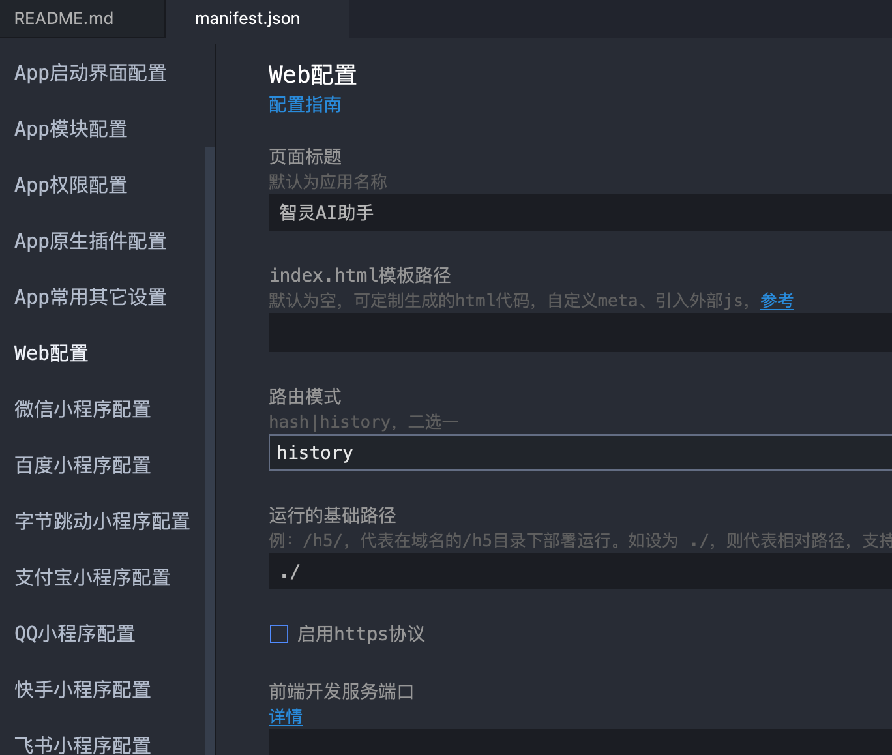
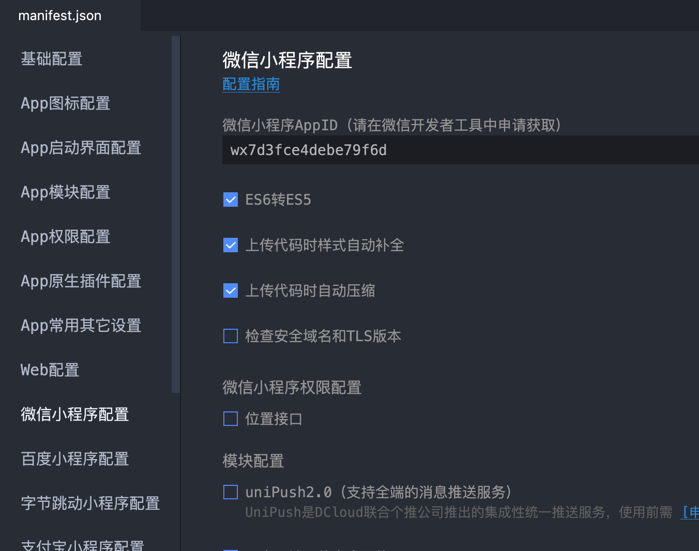

# 智灵AI助手

**基于uniapp开发, 使用 Vue3 、 ts进行开发**

# 项目运行
- 安装nodejs
- 安装依赖
```sh
yarn / npm install
```
- 安装HBuilderX
## 网页运行
- 通过HBuilderX打开项目,点击运行—运行到浏览器

## 微信小程序运行
- 安装微信开发者工具
- 通过HBuilderX打开项目,点击运行—运行到小程序模拟器—微信开发者工具


# 网页打包
- 点击发行—网站—PC Web或手机H5(仅适用于uni-app)
- 打开弹窗后点击发行按钮后,耐心等待打包
- 打包完成后到unpackage目录下获取到打包后的文件, 具体路径为 /unpackage/dist/build/h5
- 然后就把包发到服务器上部署
- 
**注意:**
由于配置路由模式为history,所以nginx需要配置try_files
```sh
try_files $uri $uri/ /index.html;
```


# 微信小程序打包
- 点击发行—小程序—微信(仅适用于uni-app)
- 打开弹窗后点击发行按钮后,会自动打开微信开发者工具,微信开发者工具加载完项目后点击提交就上传代码即可.


# 主要目录文件介绍
| 目录/文件    | 	描述    |
| ------------- | ------------ |
| http | 接口位置 |
| components    | 全局组件 |
| config   | 公共配置项    |
| config/env.ts | 环境变量 |
| config/request.ts | 统一请求 |
| declare/* | 声明文件 |
| http | 接口文件 |
| model  | 数据模型 |
| pages | 页面 |
| static | 静态文件(图片/字体/css)  |
| unpackage | 打包的文件 |
| utils | 自定义插件 |
| App.vue | 主页面 |
| main.js | 入口文件 |
| manifest.json | 项目配置文件 |

